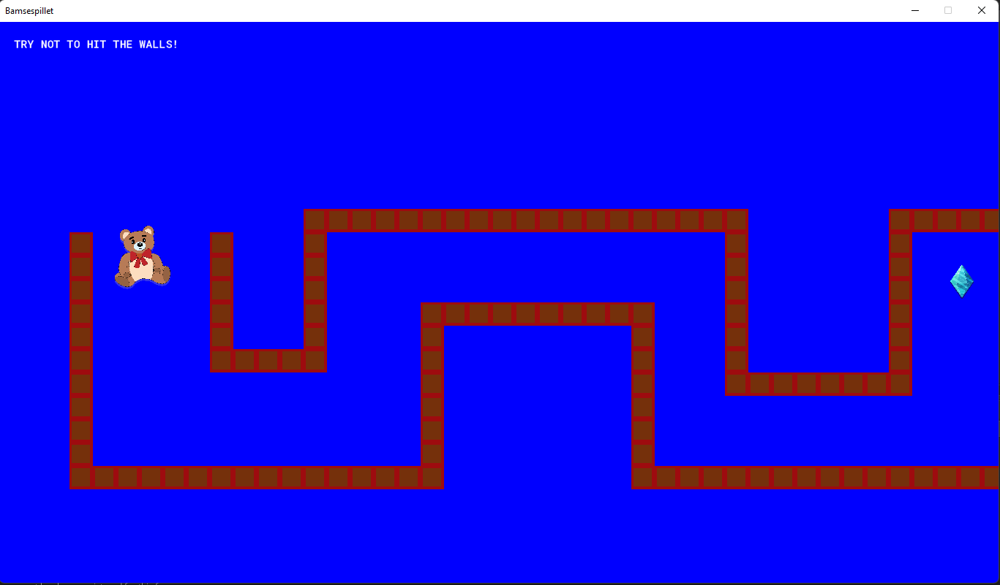
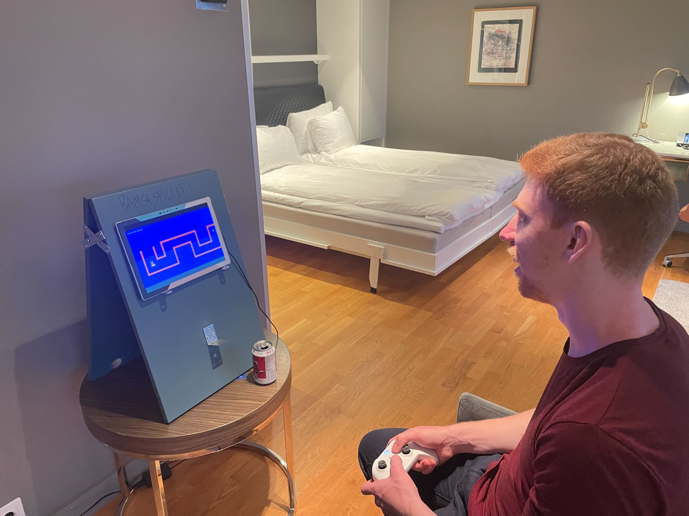

# Bamsespillet

Dette er en gjenskapelse av eller en hyllest til min gode venn Tord sitt spill som han lagde når han var mellom 10-12 år gammel (ca år 1998-2000) og eksperimenterte med et program som heter GameMaker.

Siden originalfilene er tapt for alltid, så er dette spillet designet på nytt ut ifra minnene våre fra når vi spilte det som ung, og siden dette ble laget i forbindelse med Tords utdrikningslag så kunne vi ikke spørre han heller om detaljer.

Spillet er laget i samme program som da, i GameMaker, bare en ekstremt nyere versjon. Så hvis du vil laste ned kildekoden og leke med det så kan du gå inn på https://gamemaker.io/en/gamemaker og laste ned GameMaker. 

**Release er kun for Windows, men har muligheter til å eksporteres til macOS, Android, iOS m.m, så gjerne lag et issue hvis du vil ha spillet på din plattform.**

## Hva går spillet ut på?

Du er en bamse som flyr rundt på et brett og målet ditt er å få tak i diamanten. Lett som bare det, eller?

## Kontrollene

Du kan bruke keyboard eller en gamepad.

For keyboard så bruker du piltastene for å endre retningen bamsen flyr i. Escape-knappen pauser spillet og trykk på R for å restarte brettet.
På gamepad er det D-paden som gjelder, og start/select knappene som gjør det samme.

Alt+Enter skifter mellom fullskjerm og vindumodus.

## Demo

